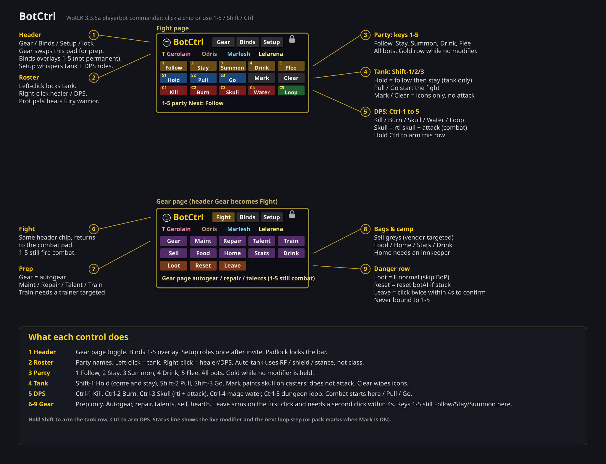

# BotCtrl

Playerbot commander for **World of Warcraft 3.3.5a** (Interface 30300). Clickable pad plus optional 1–5 / Shift / Ctrl binds. Names come from the party roster — nothing is hardcoded.

Combat keys never send `autogear` or `leave`. Those live on the Gear page.



## Install

Unzip the GitHub download. Copy the inner **BotCtrl** folder (the one that contains `BotCtrl.toc`) into:

```
Interface/AddOns/BotCtrl
```

Do not copy the outer folder that also has this README — WoW only loads a folder that has `BotCtrl.toc` at its top level.

Enable **BotCtrl** at character select. `/reload` after updates.

## Fight page (default)

| Row | Buttons |
| --- | --- |
| Party | 1 Follow, 2 Stay, 3 Summon, 4 Drink, 5 Flee |
| Tank | Shift-1 Hold, Shift-2 Pull, Shift-3 Go, **Mark**, **Clear** |
| DPS | Ctrl-1 Kill, Ctrl-2 Burn, Ctrl-3 Skull, Ctrl-4 Water, Ctrl-5 Loop |

Hold Shift or Ctrl to highlight the live row. Click **Binds** to overlay 1–5 (does not permanently steal the action bar). `/bot unbind` restores it.

### Tank

Auto-tank uses real signals, not class: Righteous Fury, Defensive Stance, Frost Presence, bear form, or a shield. A fury warrior will not beat a prot paladin. Left-click a name to **lock** tank; right-click healer / DPS.

**Setup** (once after invite) whispers `co +tank` / `nc +follow` to the tank and `co +dps` to the rest.

### Pack marks

**Mark** ON, nameplates (V), mouse over the pack. Casters/healers get skull. Icons only — bots do not attack until **Pull**, **Go**, or **Kill** / **Skull**. **Clear** wipes markers.

## Gear page

Header **Gear** / **Fight** toggles the pad. 1–5 still fire combat commands.

Autogear, maintenance, repair, talents, trainer learn, sell greys, food, hearth, stats, loot, reset AI. **Leave** requires a second click.

Train / Sell / Home only light up with a trainer, vendor, or innkeeper targeted.

## Slash

```
/bot
/bot gear | fight
/bot mark | clear | melee
/bot tank Name
/bot binds | unbind
```

